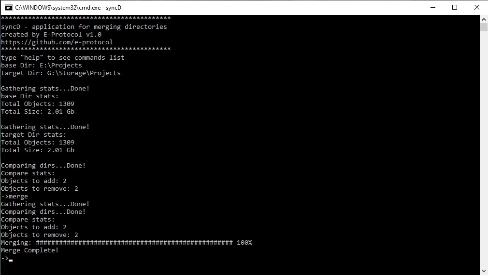

********************************************************************************

## SyncD

## Description
App for merging directories or cloning disks. 
Multi-threaded. 
Target OS: Windows 10 

## Update
Code full refactoring v1.3

## Known Issue
Can't operate with files or directories with too long path. Because of Win32 functions, which use var MAX_PATH which is 260 symbols length. 
